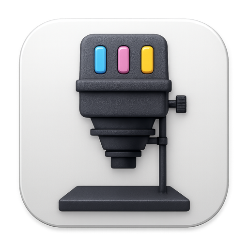
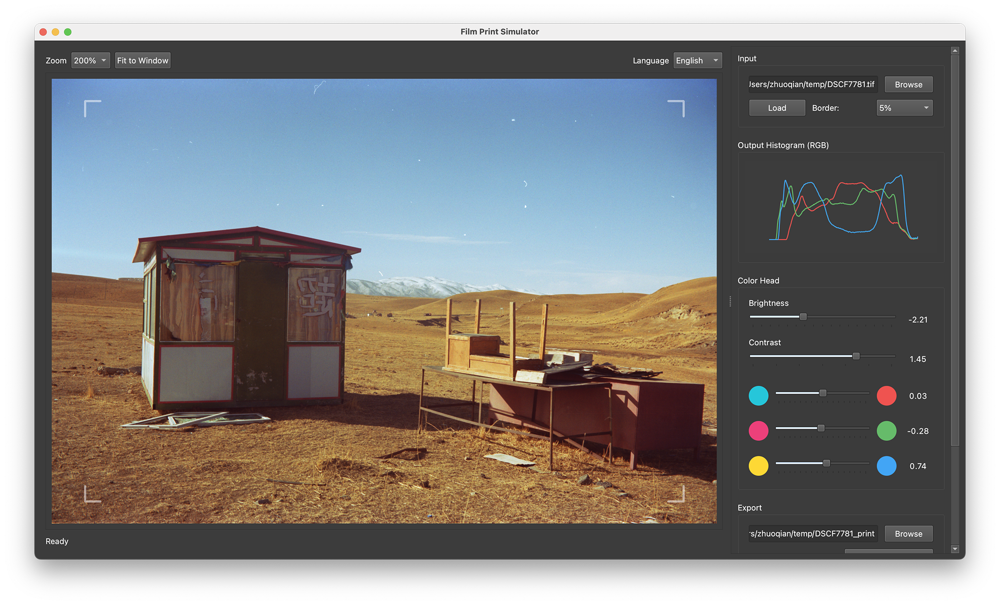

# Film Print Simulator

A tool for inverting and color correcting scanned film negatives, achieved by simulating the process of analog enlargement..

For those into film photography 🎞️ who scan your negatives with a digital camera 📷, you've probably noticed the strong orange mask 🟧. It's not just a fixed orange layer — it's actually two positive images (magenta and yellow) stacked together as part of the dye compensation process.

You can't remove the mask with just white balance tools.
Curves can work, but it's tedious and hard to master.
In the darkroom, artists would simply adjust the CMY light intensities to color-correct precisely.
So, why not simulate that with an algorithm?

1. Convert the scan into film density data
2. Simulate different CMY light intensities during exposure
3. Calculate the final reflectance after paper development

## Installation

Please head to `Releases` and download the one corresponding to your OS.

## Command-Line Version

Please head to `CLI.md` for installation and usage intstructions for the command line interface.

## Notes

This is a very basic tool in its early stages. I welcome any feedback, suggestions, or contributions that could help improve this project. Feel free to open an issue or submit a pull request.
